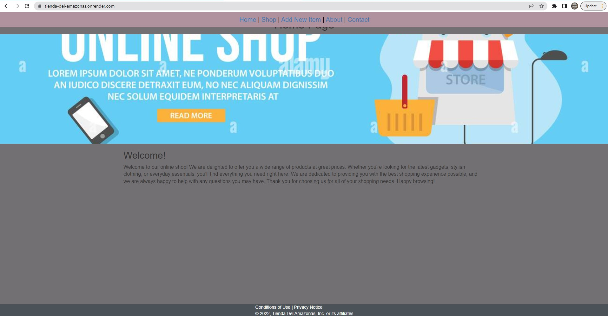
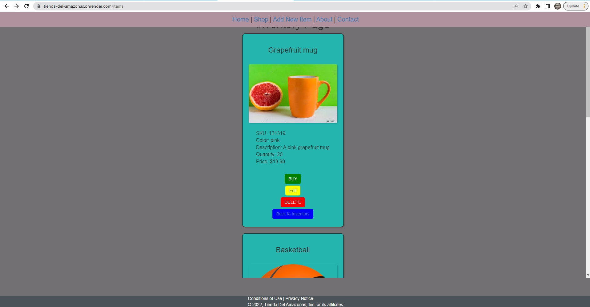
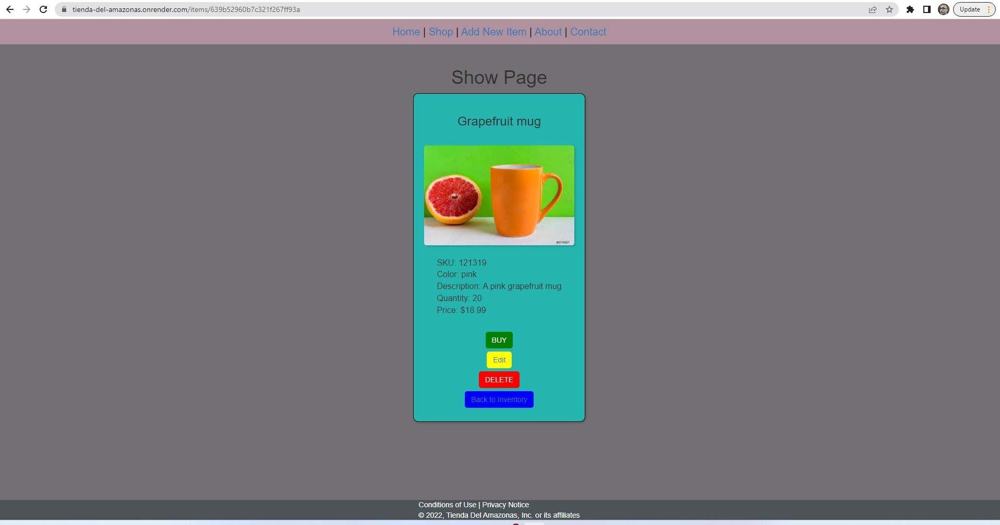
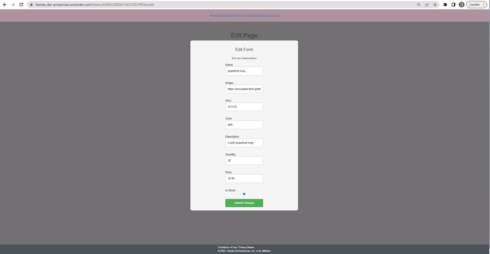
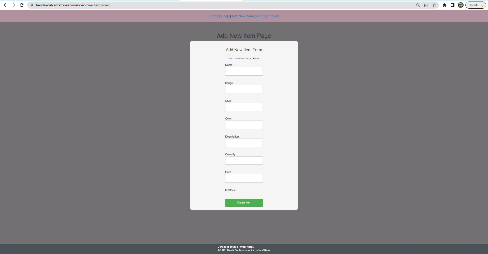
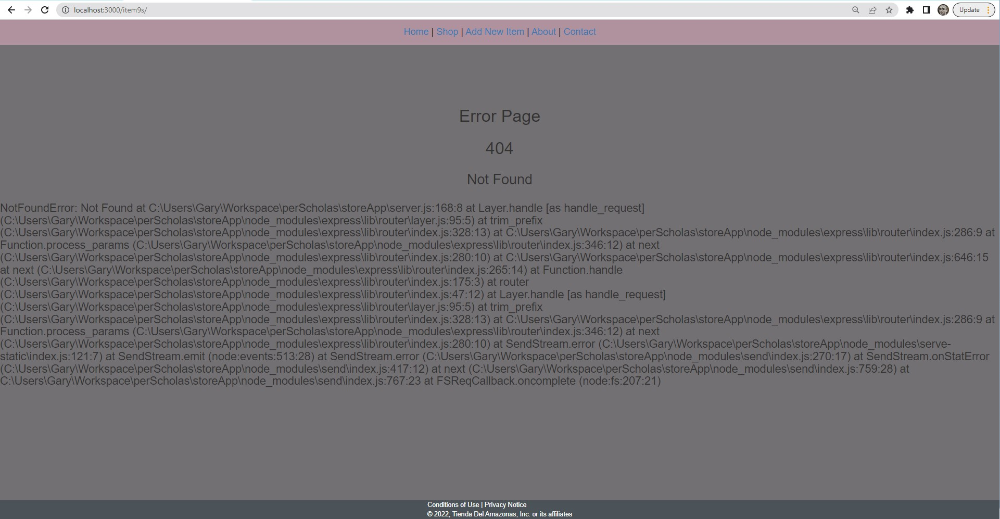

# Tienda Del Amazonas

## About

This is a Node/Express backend-application that allows users to create and track a simple online inventory. A view engine is implemented with JSX templates in order to generate a simple static site that serves as a user interface. Data is stored via MongoDB online.

[GitHub Repository](https://github.com/glnewton/storeApp)

[Live Site](https://tienda-del-amazonas.onrender.com/)

## Project Requirements

[Requirements](./docs/Requirements.md)

## Screenshots

## Build Status

Project is a hosted and deployed via Render and is connected to the GitHub Repository to redploy on new commits/pushes.

## Code Style

Elements of both functional programming and object-oriented programming are used in this project.

## Design

Color Palette from: <https://coolors.co/104547-4b5358-25b5af-727072-af929d>

## Technologies, Languages, Libraries & Platforms Used

- HTML
- CSS
  - CSS Library: Bootstrap (buttons mainly)
- JavaScript
- NodeJS
- ExpressJS
  - JSX
- MongoDB (Cloud NoSQL Database)
- Render (IaaS Platform)

## Features

1. Users can performa basic CRUD operations for items in the store via a simple user-interface.
2. All changes persist whether local or on the deployed site.

## Project Directory

`project/
├── server.js
├── package.json
├── package-lock.json
├── README.md
├── docs/
├── database/
│ ├── dbConnection.js
│ ├── models/
│ └── item.js
├── public/
│ ├── images/
│ ├── stylesheets/
│ └── style.css
├── routes/
│ └── home.js
└── views/
├── pages/
├── partials/
│ ├── Card.jsx
│ ├── EditForm.jsx
│ ├── Footer.jsx
│ ├── Header.jsx
│ └── NewForm.jsx
├── Default.jsx
├── Edit.jsx
├── Error.jsx
├── Home.jsx
├── Index.jsx
├── New.jsx
└── Show.jsx`

### Files & Directories

- server.js - the main file for the express app, where the express app is created and the middleware and routes are set up
- package.json - lists the packages (including express) that the project depends on, as well as scripts for running the app and testing
- package-lock.json - records the exact versions of package dependencies that were installed
- README.md - a file containing information about the project, including instructions for how to set it up and use it. This file is often displayed on the project's homepage on GitHub.
- public/ - contains static assets such as images, JavaScript files, and CSS stylesheets
- routes/ - contains the route handlers for the app, which define the behavior for each URL endpoint
- views/ - contains the template files for the views rendered by the app, written in JSX
- views/partials/ - contains partial template files that can be included in other views
- database/ - contains the code for connecting to and interacting with the database.
- dbConnection.js - exports the code for connecting to and interacting with the database.
- database/models/ - This directory contain files for setting up the database schema and defining models for interacting with the data in MongoDB via Mongoose
- docs/ - contains documentation files for the project, iscreenshots, requirements and other files used by the developer such as an API reference or user guide.

## Routes

| URL               | HTTP Verb | Action | Notes & Examples                                                                                                                                                                         |
| ----------------- | --------- | ------ | ---------------------------------------------------------------------------------------------------------------------------------------------------------------------------------------- |
| /                 | GET       | Home   | Home Route - Returns the home page when a user types <http://localhost:3000/> in browser this route shows a simple welcome page.                                                           |
| /items/           | GET       | Index  | INDEX Route - Returns the inventory page when a user types <http://localhost:3000/items> in the browser this route shows a list or index of all items                                      |
| /items/new        | GET       | New    | NEW Route - Returns the new item page when a user types <http://localhost:3000/items/new> in browser this route shows the user a form to create a NEW item                                 |
| /items/:id/delete | DELETE    | Delete | DELETE Route - initiates a DELETE request through a form submission with action = <http://localhost:3000/items/:id/delete> and allows the application the ability to delete a item         |
| /items/:id/update | PUT       | Update | UPDATE Route - initiates a PUT request through a form submission with action = <http://localhost:3000/items/:id/update> and allows the application the ability to Update data about a item |
| /items/create     | POST      | Create | CREATE Route - initiates a POST request through a form submission with action = <http://localhost:3000/items/create> and allows the application the ability to Create a item               |
| /items/:id/edit   | GET       | Edit   | EDIT Route - Returns the edit item page when a user types <http://localhost:3000/items/:id/edit> in browser shows the user a form to edit a item                                           |
| /items/:id        | GET       | Show   | SHOW Route - Returns the show item page when a user types <http://localhost:3000/items/:id> shows the user an individual item in the browser                                               |

## Installation Instructions

**Step 1: Clone the repository**

Run the following code in your terminal to download the code:

`git clone https://github.com/glnewton/storeApp.git`

**Step 2: Install Dependencies**

`npm install`

**Step 3: Configure the application**

Create the .env file and the appropriate local or cloud database.

**Step 4: Start the application**

`npm start`

The app will now be running at <http://localhost:3000>.

## Store Functionality

1. Users can performa basic CRUD operations for items in the store via a simple user-interface.
2. All changes persist whether local or on the deployed site.

## Known Issues

- Error page renders locally, but not on the hosted page.
- File tree does not display correctly in README.md
- Numerous CSS Issues
  - Page Header is often not displayed on most pages
- Some directories and files were kept but not used.
- Separate routing and controller files was not fully implemented
- Documentation is incomplete
- Try/Catch error handling was not fully implemented
- Unable to successfully seed database without errors

## Roadmap

- Address the above issues
- Refactor with TypeScript

## Acknowledgements  

- To Cycle 28
- To the apprentices
- To G,T,K,M et al

## Resources

- <https://developer.mozilla.org/en-US/docs/Learn/Server-side/Express_Nodejs>
- <https://github.com/mdn/express-locallibrary-tutorial>
- <https://github.com/Viveckh/Veniqa>
- <https://github.com/KasperKain/PerScholas-Fruits>

## Disclaimer

I am not affliated with any of the above and all work used is for educational and demonstration purposes only. No profit is generated from this project.

## License

MIT License

MIT © [Gary Newton]()
